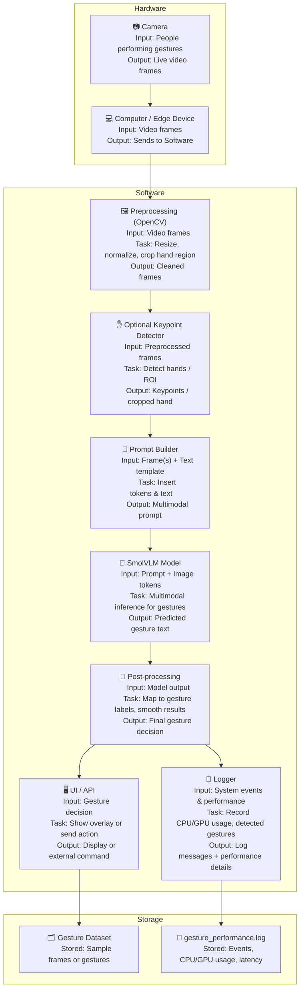

# System Architecture Diagram

```mermaid
graph TD

    %% Hardware
    subgraph Hardware
        Camera["📷 Camera
        Input: People performing gestures
        Output: Live video frames"]

        Computer["💻 Computer / Edge Device
        Input: Video frames
        Output: Sends to Software"]
    end

    %% Software
    subgraph Software
        Preprocess["🖼️ Preprocessing (OpenCV)
        Input: Video frames
        Task: Resize, normalize, crop hand region
        Output: Cleaned frames"]

        Keypoint["✋ Optional Keypoint Detector
        Input: Preprocessed frames
        Task: Detect hands / ROI
        Output: Keypoints / cropped hand"]

        PromptBuilder["📝 Prompt Builder
        Input: Frame(s) + Text template
        Task: Insert <image> tokens & text
        Output: Multimodal prompt"]

        SmolVLM["🤖 SmolVLM Model
        Input: Prompt + Image tokens
        Task: Multimodal inference for gestures
        Output: Predicted gesture text"]

        Postprocess["🔄 Post-processing
        Input: Model output
        Task: Map to gesture labels, smooth results
        Output: Final gesture decision"]

        UI["🖥️ UI / API
        Input: Gesture decision
        Task: Show overlay or send action
        Output: Display or external command"]

        Logger["📝 Logger
        Input: System events & performance
        Task: Record CPU/GPU usage, detected gestures
        Output: Log messages + performance details"]
    end

    %% Storage
    subgraph Storage
        GestureDB["🗂️ Gesture Dataset
        Stored: Sample frames or gestures"]

        LogFile["📄 gesture_performance.log
        Stored: Events, CPU/GPU usage, latency"]
    end

    %% Connections
    Camera --> Computer
    Computer --> Preprocess
    Preprocess --> Keypoint
    Keypoint --> PromptBuilder
    PromptBuilder --> SmolVLM
    SmolVLM --> Postprocess
    Postprocess --> UI
    Postprocess --> Logger
    Logger --> LogFile
    UI --> GestureDB

```
