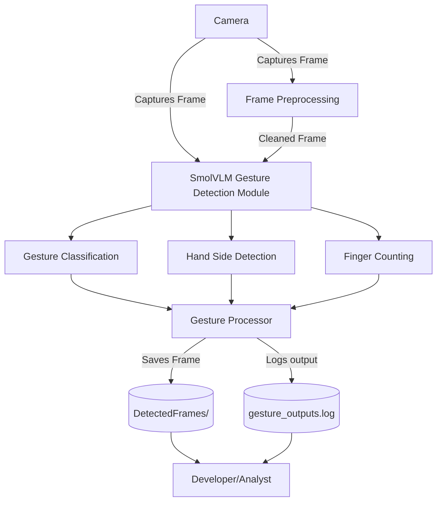

# Data Flow Diagram (DFD)

```mermaid
flowchart TD
    Camera -->|Captures Frame| Preprocess[Frame Preprocessing]
    Camera -->|Captures Frame| SmolVLM[SmolVLM Gesture Detection Module]

    Preprocess -->|Cleaned Frame| SmolVLM

    SmolVLM --> GestureType[Gesture Classification]
    SmolVLM --> HandSide[Hand Side Detection]
    SmolVLM --> FingerCount[Finger Counting]

    GestureType --> GestureProcessor[Gesture Processor]
    HandSide --> GestureProcessor
    FingerCount --> GestureProcessor

    GestureProcessor -->|Logs output| GestureLogFile[(gesture_outputs.log)]
    GestureProcessor -->|Saves Frame| Frames[(DetectedFrames/)]

    Frames --> Developer[Developer/Analyst]
    GestureLogFile --> Developer[Developer/Analyst]

```
