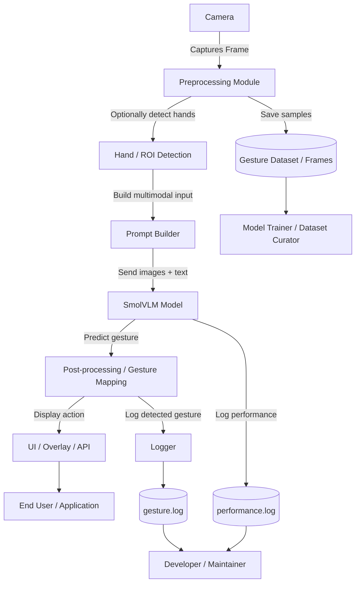

# Data Flow Diagram (DFD)

```mermaid
flowchart TD
    %% Capture
    Camera -->|Captures Frame| Preprocess[Preprocessing Module]

    %% Preprocessing & Prompt
    Preprocess -->|Optionally detect hands| Keypoint[Hand / ROI Detection]
    Keypoint -->|Build multimodal input| PromptBuilder[Prompt Builder]

    %% SmolVLM Inference
    PromptBuilder -->|Send images + text| SmolVLM[SmolVLM Model]
    SmolVLM -->|Predict gesture| Postprocess[Post-processing / Gesture Mapping]

    %% Output & Logging
    Postprocess -->|Display action| UI[UI / Overlay / API]
    Postprocess -->|Log detected gesture| GestureLogger[Logger]

    %% Storage
    GestureLogger --> GestureLogFile[(gesture.log)]
    Preprocess -->|Save samples| GestureDB[(Gesture Dataset / Frames)]
    SmolVLM -->|Log performance| PerfLog[(performance.log)]

    %% Stakeholders
    UI --> EndUser[End User / Application]
    GestureLogFile --> Developer[Developer / Maintainer]
    PerfLog --> Developer
    GestureDB --> Trainer[Model Trainer / Dataset Curator]


```
